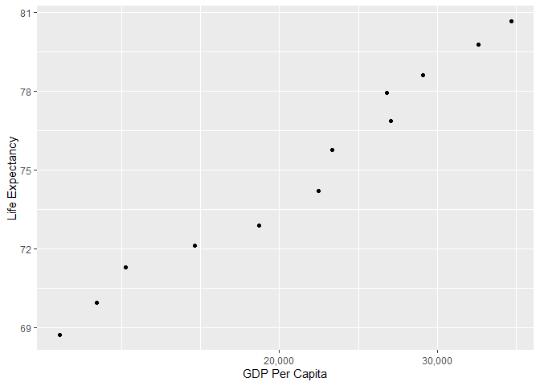
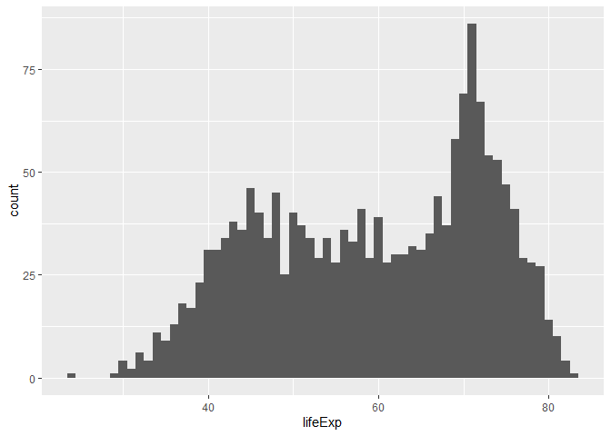
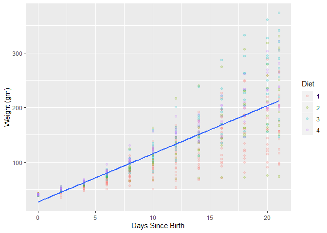
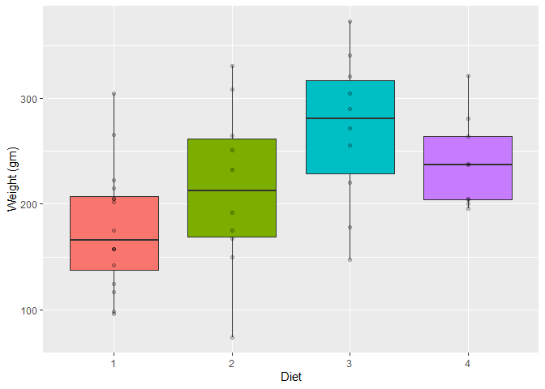

```r
# install.packages('moments')
suppressPackageStartupMessages(library(DT))
suppressPackageStartupMessages(library(gapminder))
suppressPackageStartupMessages(library(moments))
suppressPackageStartupMessages(library(scales))
suppressPackageStartupMessages(library(tidyverse))
suppressPackageStartupMessages(library(tsibble))
knitr::opts_chunk$set(fig.align = "center")
options(knitr.table.format = 'markdown')
```

# 1.1 & 1.2

First, I used the filter() function to subset the gapminder data to the three countries of my choice in the 1970s: Cambodia, the United States, and Vietnam. Next, I used the pipe operator to select the "country" and "gdpPercap" variables from my filtered dataset.

<!--html_preserve--><div id="htmlwidget-dd1010751767a0f0c321" style="width:100%;height:auto;" class="datatables html-widget"></div>
<script type="application/json" data-for="htmlwidget-dd1010751767a0f0c321">{"x":{"filter":"none","data":[["1","2","3","4","5","6"],["Cambodia","Cambodia","United States","United States","Vietnam","Vietnam"],[421.6240257,524.9721832,21806.03594,24072.63213,699.5016441,713.5371196]],"container":"<table class=\"display\">\n  <thead>\n    <tr>\n      <th> <\/th>\n      <th>country<\/th>\n      <th>gdpPercap<\/th>\n    <\/tr>\n  <\/thead>\n<\/table>","options":{"columnDefs":[{"className":"dt-right","targets":2},{"orderable":false,"targets":0}],"order":[],"autoWidth":false,"orderClasses":false}},"evals":[],"jsHooks":[]}</script><!--/html_preserve-->

# 1.3

After using the lag() function to compute lifeExp_change, a new variable in my tibble that is the change in life expectancy, I filtered the gapminder data to all entries that experienced a drop in life expectancy.

<!--html_preserve--><div id="htmlwidget-980a1ebf82c0031e2481" style="width:100%;height:auto;" class="datatables html-widget"></div>
<script type="application/json" data-for="htmlwidget-980a1ebf82c0031e2481">{"x":{"filter":"none","data":[["1","2","3","4","5","6","7","8","9","10","11","12","13","14","15","16","17","18","19","20","21","22","23","24","25","26","27","28","29","30","31","32","33","34","35","36","37","38","39","40","41","42","43","44","45","46","47","48","49","50","51","52","53","54","55","56","57","58","59","60","61","62","63","64","65","66","67","68","69","70","71","72","73","74","75","76","77","78","79","80","81","82","83","84","85","86","87","88","89","90","91","92","93","94","95","96","97","98","99","100","101","102"],["China","Cambodia","Czech Republic","Netherlands","Slovak Republic","Bulgaria","Cambodia","El Salvador","Poland","Uganda","Congo, Dem. Rep.","Croatia","Denmark","El Salvador","Eritrea","Hungary","Serbia","Uganda","Angola","Congo, Dem. Rep.","Norway","Poland","Romania","Rwanda","Zambia","Albania","Botswana","Bulgaria","Burundi","Cameroon","Central African Republic","Congo, Dem. Rep.","Congo, Rep.","Cote d'Ivoire","Hungary","Iraq","Jamaica","Kenya","Korea, Dem. Rep.","Liberia","Puerto Rico","Romania","Rwanda","Sierra Leone","Somalia","Tanzania","Uganda","Zambia","Zimbabwe","Botswana","Bulgaria","Cameroon","Central African Republic","Chad","Congo, Dem. Rep.","Congo, Rep.","Cote d'Ivoire","Gabon","Iraq","Kenya","Korea, Dem. Rep.","Lesotho","Malawi","Namibia","Nigeria","South Africa","Swaziland","Tanzania","Trinidad and Tobago","Uganda","Zambia","Zimbabwe","Benin","Botswana","Cameroon","Central African Republic","Chad","Cote d'Ivoire","Gabon","Ghana","Iraq","Jamaica","Kenya","Korea, Dem. Rep.","Lesotho","Malawi","Montenegro","Mozambique","Myanmar","Namibia","Nigeria","South Africa","Swaziland","Togo","Trinidad and Tobago","Zambia","Zimbabwe","Gabon","Lesotho","Mozambique","South Africa","Swaziland"],["Asia","Asia","Europe","Europe","Europe","Europe","Asia","Americas","Europe","Africa","Africa","Europe","Europe","Americas","Africa","Europe","Europe","Africa","Africa","Africa","Europe","Europe","Europe","Africa","Africa","Europe","Africa","Europe","Africa","Africa","Africa","Africa","Africa","Africa","Europe","Asia","Americas","Africa","Asia","Africa","Americas","Europe","Africa","Africa","Africa","Africa","Africa","Africa","Africa","Africa","Europe","Africa","Africa","Africa","Africa","Africa","Africa","Africa","Asia","Africa","Asia","Africa","Africa","Africa","Africa","Africa","Africa","Africa","Americas","Africa","Africa","Africa","Africa","Africa","Africa","Africa","Africa","Africa","Africa","Africa","Asia","Americas","Africa","Asia","Africa","Africa","Europe","Africa","Asia","Africa","Africa","Africa","Africa","Africa","Americas","Africa","Africa","Africa","Africa","Africa","Africa","Africa"],[1962,1972,1972,1972,1972,1977,1977,1977,1977,1977,1982,1982,1982,1982,1982,1982,1982,1982,1987,1987,1987,1987,1987,1987,1987,1992,1992,1992,1992,1992,1992,1992,1992,1992,1992,1992,1992,1992,1992,1992,1992,1992,1992,1992,1992,1992,1992,1992,1992,1997,1997,1997,1997,1997,1997,1997,1997,1997,1997,1997,1997,1997,1997,1997,1997,1997,1997,1997,1997,1997,1997,1997,2002,2002,2002,2002,2002,2002,2002,2002,2002,2002,2002,2002,2002,2002,2002,2002,2002,2002,2002,2002,2002,2002,2002,2002,2002,2007,2007,2007,2007,2007],[44.50136,40.317,70.29,73.75,70.35,70.81,31.22,56.696,70.67,50.35,47.784,70.46,74.63,56.604,43.89,69.39,70.162,49.849,39.906,47.412,75.89,70.98,69.53,44.02,50.821,71.581,62.745,71.19,44.736,54.314,49.396,45.548,56.433,52.044,69.17,59.461,71.766,59.285,69.978,40.802,73.911,69.36,23.599,38.333,39.658,50.44,48.825,46.1,60.377,52.556,70.32,52.199,46.066,51.573,42.587,52.962,47.991,60.461,58.811,54.407,67.727,55.558,47.495,58.909,47.464,60.236,54.289,48.466,69.465,44.578,40.238,46.809,54.406,46.634,49.856,43.308,50.525,46.832,56.761,58.453,57.046,72.047,50.992,66.662,44.593,45.009,73.981,44.026,59.908,51.479,46.608,53.365,43.869,57.561,68.976,39.193,39.989,56.735,42.592,42.082,49.339,39.613],[665770000,7450606,9862158,13329874,4593433,8797022,6978607,4282586,34621254,11457758,30646495,4413368,5117810,4474873,2637297,10705535,9032824,12939400,7874230,35481645,4186147,37740710,22686371,6349365,7272406,3326498,1342614,8658506,5809236,12467171,3265124,41672143,2409073,12772596,10348684,17861905,2378618,25020539,20711375,1912974,3585176,22797027,7290203,4260884,6099799,26605473,18252190,8381163,10704340,1536536,8066057,14195809,3696513,7562011,47798986,2800947,14625967,1126189,20775703,28263827,21585105,1982823,10419991,1774766,106207839,42835005,1054486,30686889,1138101,21210254,9417789,11404948,7026113,1630347,15929988,4048013,8835739,16252726,1299304,20550751,24001816,2664659,31386842,22215365,2046772,11824495,720230,18473780,45598081,1972153,119901274,44433622,1130269,4977378,1101832,10595811,11926563,1454867,2012649,19951656,43997828,1133066],[487.6740183,421.6240257,13108.4536,18794.74567,9674.167626,7612.240438,524.9721832,5138.922374,9508.141454,843.7331372,673.7478181,13221.82184,21688.04048,4098.344175,524.8758493,12545.99066,15181.0927,682.2662268,2430.208311,672.774812,31540.9748,9082.351172,9696.273295,847.991217,1213.315116,2497.437901,7954.111645,6302.623438,631.6998778,1793.163278,747.9055252,457.7191807,4016.239529,1648.073791,10535.62855,3745.640687,7404.923685,1341.921721,3726.063507,636.6229191,14641.58711,6598.409903,737.0685949,1068.696278,926.9602964,825.682454,644.1707969,1210.884633,693.4207856,8647.142313,5970.38876,1694.337469,740.5063317,1004.961353,312.188423,3484.164376,1786.265407,14722.84188,3076.239795,1360.485021,1690.756814,1186.147994,692.2758103,3899.52426,1624.941275,7479.188244,3876.76846,789.1862231,8792.573126,816.559081,1071.353818,792.4499603,1372.877931,11003.60508,1934.011449,738.6906068,1156.18186,1648.800823,12521.71392,1111.984578,4390.717312,6994.774861,1287.514732,1646.758151,1275.184575,665.4231186,6557.194282,633.6179466,611,4072.324751,1615.286395,7710.946444,4128.116943,886.2205765,11460.60023,1071.613938,672.0386227,13206.48452,1569.331442,823.6856205,9269.657808,4513.480643],[-6.0476,-5.098,-0.0899999999999892,-0.0699999999999932,-0.63000000000001,-0.0900000000000034,-9.097,-1.511,-0.179999999999993,-0.665999999999997,-0.0200000000000031,-0.180000000000007,-0.0600000000000023,-0.0919999999999987,-0.644999999999996,-0.560000000000002,-0.137999999999991,-0.501000000000005,-0.0360000000000014,-0.372,-0.0799999999999983,-0.339999999999989,-0.129999999999995,-2.198,-1,-0.418999999999997,-0.877000000000002,-0.150000000000006,-3.475,-0.670999999999999,-1.089,-1.864,-1.037,-2.611,-0.409999999999997,-5.583,-0.00399999999999068,-0.054000000000002,-0.669000000000011,-5.225,-0.718999999999994,-0.170000000000002,-20.421,-1.673,-4.843,-1.095,-2.684,-4.721,-1.974,-10.189,-0.870000000000005,-2.115,-3.33,-0.150999999999996,-2.961,-3.471,-4.053,-0.905000000000001,-0.649999999999999,-4.878,-2.25099999999999,-4.127,-1.925,-3.09,-0.00800000000000267,-1.652,-4.185,-1.974,-0.396999999999991,-4.247,-5.862,-13.568,-0.371000000000002,-5.922,-2.343,-2.758,-1.048,-1.159,-3.7,-0.102999999999994,-1.765,-0.215000000000003,-3.415,-1.065,-10.965,-2.486,-1.464,-2.318,-0.420000000000002,-7.43,-0.856000000000002,-6.871,-10.42,-0.829000000000001,-0.489000000000004,-1.045,-6.82,-0.0260000000000034,-2.001,-1.944,-4.026,-4.256]],"container":"<table class=\"display\">\n  <thead>\n    <tr>\n      <th> <\/th>\n      <th>country<\/th>\n      <th>continent<\/th>\n      <th>year<\/th>\n      <th>lifeExp<\/th>\n      <th>pop<\/th>\n      <th>gdpPercap<\/th>\n      <th>lifeExp_change<\/th>\n    <\/tr>\n  <\/thead>\n<\/table>","options":{"columnDefs":[{"className":"dt-right","targets":[3,4,5,6,7]},{"orderable":false,"targets":0}],"order":[],"autoWidth":false,"orderClasses":false}},"evals":[],"jsHooks":[]}</script><!--/html_preserve-->

# 1.4

Using the max() function, I filtered the gapminder data to show the maximum GDP per capita experienced by each country.

<!--html_preserve--><div id="htmlwidget-e66beba42ea7ad970b5c" style="width:100%;height:auto;" class="datatables html-widget"></div>
<script type="application/json" data-for="htmlwidget-e66beba42ea7ad970b5c">{"x":{"filter":"none","data":[["1","2","3","4","5","6","7","8","9","10","11","12","13","14","15","16","17","18","19","20","21","22","23","24","25","26","27","28","29","30","31","32","33","34","35","36","37","38","39","40","41","42","43","44","45","46","47","48","49","50","51","52","53","54","55","56","57","58","59","60","61","62","63","64","65","66","67","68","69","70","71","72","73","74","75","76","77","78","79","80","81","82","83","84","85","86","87","88","89","90","91","92","93","94","95","96","97","98","99","100","101","102","103","104","105","106","107","108","109","110","111","112","113","114","115","116","117","118","119","120","121","122","123","124","125","126","127","128","129","130","131","132","133","134","135","136","137","138","139","140","141","142"],["Afghanistan","Albania","Algeria","Angola","Argentina","Australia","Austria","Bahrain","Bangladesh","Belgium","Benin","Bolivia","Bosnia and Herzegovina","Botswana","Brazil","Bulgaria","Burkina Faso","Burundi","Cambodia","Cameroon","Canada","Central African Republic","Chad","Chile","China","Colombia","Comoros","Congo, Dem. Rep.","Congo, Rep.","Costa Rica","Cote d'Ivoire","Croatia","Cuba","Czech Republic","Denmark","Djibouti","Dominican Republic","Ecuador","Egypt","El Salvador","Equatorial Guinea","Eritrea","Ethiopia","Finland","France","Gabon","Gambia","Germany","Ghana","Greece","Guatemala","Guinea","Guinea-Bissau","Haiti","Honduras","Hong Kong, China","Hungary","Iceland","India","Indonesia","Iran","Iraq","Ireland","Israel","Italy","Jamaica","Japan","Jordan","Kenya","Korea, Dem. Rep.","Korea, Rep.","Kuwait","Lebanon","Lesotho","Liberia","Libya","Madagascar","Malawi","Malaysia","Mali","Mauritania","Mauritius","Mexico","Mongolia","Montenegro","Morocco","Mozambique","Myanmar","Namibia","Nepal","Netherlands","New Zealand","Nicaragua","Niger","Nigeria","Norway","Oman","Pakistan","Panama","Paraguay","Peru","Philippines","Poland","Portugal","Puerto Rico","Reunion","Romania","Rwanda","Sao Tome and Principe","Saudi Arabia","Senegal","Serbia","Sierra Leone","Singapore","Slovak Republic","Slovenia","Somalia","South Africa","Spain","Sri Lanka","Sudan","Swaziland","Sweden","Switzerland","Syria","Taiwan","Tanzania","Thailand","Togo","Trinidad and Tobago","Tunisia","Turkey","Uganda","United Kingdom","United States","Uruguay","Venezuela","Vietnam","West Bank and Gaza","Yemen, Rep.","Zambia","Zimbabwe"],["Asia","Europe","Africa","Africa","Americas","Oceania","Europe","Asia","Asia","Europe","Africa","Americas","Europe","Africa","Americas","Europe","Africa","Africa","Asia","Africa","Americas","Africa","Africa","Americas","Asia","Americas","Africa","Africa","Africa","Americas","Africa","Europe","Americas","Europe","Europe","Africa","Americas","Americas","Africa","Americas","Africa","Africa","Africa","Europe","Europe","Africa","Africa","Europe","Africa","Europe","Americas","Africa","Africa","Americas","Americas","Asia","Europe","Europe","Asia","Asia","Asia","Asia","Europe","Asia","Europe","Americas","Asia","Asia","Africa","Asia","Asia","Asia","Asia","Africa","Africa","Africa","Africa","Africa","Asia","Africa","Africa","Africa","Americas","Asia","Europe","Africa","Africa","Asia","Africa","Asia","Europe","Oceania","Americas","Africa","Africa","Europe","Asia","Asia","Americas","Americas","Americas","Asia","Europe","Europe","Americas","Africa","Europe","Africa","Africa","Asia","Africa","Europe","Africa","Asia","Europe","Europe","Africa","Africa","Europe","Asia","Africa","Africa","Europe","Europe","Asia","Asia","Africa","Asia","Africa","Americas","Africa","Europe","Africa","Europe","Americas","Americas","Americas","Asia","Asia","Asia","Africa","Africa"],[1982,2007,2007,1967,2007,2007,2007,2007,2007,2007,2007,2007,2007,2007,2007,2007,2007,1992,2007,1987,2007,1962,2007,2007,2007,2007,1972,1957,1982,2007,1982,2007,2007,2007,2007,1972,2007,1997,2007,2007,2007,1997,2007,2007,2007,1977,1977,2007,2007,2007,2007,2002,1982,1982,2007,2007,2007,2007,2007,2007,1977,1977,2007,2007,2007,1972,2007,2007,2007,1982,2007,1957,2007,2007,1972,1977,1972,2007,2007,2007,2007,2007,2007,2007,1987,2007,2007,2007,2007,2007,2007,2007,1977,1967,2007,2007,2007,2007,2007,1982,2007,2007,2007,2007,2007,2007,2007,1982,1982,1977,2007,1987,1982,2007,2007,2007,1977,2007,2007,2007,2007,2007,2007,2007,2007,2007,2007,2007,1972,2007,2007,2007,2007,2007,2007,2007,1977,2007,1997,2007,1967,1972],[39.854,76.423,72.301,35.985,75.32,81.235,79.829,75.635,64.062,79.441,56.728,65.554,74.852,50.728,72.39,73.005,52.295,44.736,59.723,54.985,80.653,39.475,50.651,78.553,72.961,72.889,48.944,40.652,56.695,78.782,53.983,75.748,78.273,76.486,78.332,44.366,72.235,72.312,71.338,71.878,51.579,53.378,52.947,79.313,80.657,52.79,41.842,79.406,60.022,79.483,70.259,53.676,39.327,51.461,70.198,82.208,73.338,81.757,64.698,70.65,57.702,60.413,78.885,80.745,80.546,69,82.603,72.535,54.11,69.1,78.623,58.033,71.993,42.592,42.614,57.442,44.851,48.303,74.241,54.467,64.164,72.801,76.195,66.803,74.865,71.164,42.082,62.069,52.906,63.785,79.762,80.204,57.47,40.118,46.859,80.196,75.64,65.483,75.537,66.874,71.421,71.688,75.563,78.098,78.746,76.442,72.476,46.218,60.351,58.69,63.062,71.218,38.445,79.972,74.663,77.926,41.974,49.339,80.941,72.396,58.556,39.613,80.884,81.701,74.143,78.4,52.517,70.616,49.759,69.819,73.923,71.777,51.542,79.425,78.242,76.384,67.456,74.249,71.096,62.698,47.768,55.635],[12881816,3600523,33333216,5247469,40301927,20434176,8199783,708573,150448339,10392226,8078314,9119152,4552198,1639131,190010647,7322858,14326203,5809236,14131858,10780667,33390141,1523478,10238807,16284741,1318683096,44227550,250027,15577932,1774735,4133884,9025951,4493312,11416987,10228744,5468120,178848,9319622,11911819,80264543,6939688,551201,4058319,76511887,5238460,61083916,706367,608274,82400996,22873338,10706290,12572928,8807818,825987,5198399,7483763,6980412,9956108,301931,1110396331,223547000,35480679,11882916,4109086,6426679,58147733,1997616,127467972,6053193,35610177,17647518,49044790,212846,3921278,2012649,1482628,2721783,7082430,13327079,24821286,12031795,3270065,1250882,108700891,2874127,569473,33757175,19951656,47761980,2055080,28901790,16570613,4115771,2554598,4534062,135031164,4627926,3204897,169270617,3242173,3366439,28674757,91077287,38518241,10642836,3942491,798094,22276056,5507565,98593,8128505,12267493,9230783,3464522,4553009,5447502,2009245,4353666,43997828,40448191,20378239,42292929,1133066,9031088,7554661,19314747,23174294,38139640,65068149,2056351,1056608,10276158,71158647,29170398,60776238,301139947,3447496,13503563,85262356,2826046,22211743,3900000,5861135],[978.0114388,5937.029526,6223.367465,5522.776375,12779.37964,34435.36744,36126.4927,29796.04834,1391.253792,33692.60508,1441.284873,3822.137084,7446.298803,12569.85177,9065.800825,10680.79282,1217.032994,631.6998778,1713.778686,2602.664206,36319.23501,1193.068753,1704.063724,13171.63885,4959.114854,7006.580419,1937.577675,905.8602303,4879.507522,9645.06142,2602.710169,14619.22272,8948.102923,22833.30851,35278.41874,3694.212352,6025.374752,7429.455877,5581.180998,5728.353514,12154.08975,913.47079,690.8055759,33207.0844,30470.0167,21745.57328,884.7552507,32170.37442,1327.60891,27538.41188,5186.050003,945.5835837,838.1239671,2011.159549,3548.330846,39724.97867,18008.94444,36180.78919,2452.210407,3540.651564,11888.59508,14688.23507,40675.99635,25523.2771,28569.7197,7433.889293,31656.06806,4519.461171,1463.249282,4106.525293,23348.13973,113523.1329,10461.05868,1569.331442,803.0054535,21951.21176,1748.562982,759.3499101,12451.6558,1042.581557,1803.151496,10956.99112,11977.57496,3095.772271,11732.51017,3820.17523,823.6856205,944,4811.060429,1091.359778,36797.93332,25185.00911,5486.371089,1054.384891,2013.977305,49357.19017,22316.19287,2605.94758,9809.185636,4258.503604,7408.905561,3190.481016,15389.92468,20509.64777,19328.70901,7670.122558,10808.47561,881.5706467,1890.218117,34167.7626,1712.472136,15870.87851,1465.010784,47143.17964,18678.31435,25768.25759,1450.992513,9269.657808,28821.0637,3970.095407,2602.394995,4513.480643,33859.74835,37506.41907,4184.548089,28718.27684,1107.482182,7458.396327,1649.660188,18008.50924,7092.923025,8458.276384,1056.380121,33203.26128,42951.65309,10611.46299,13143.95095,2441.576404,7110.667619,2280.769906,1777.077318,799.3621758]],"container":"<table class=\"display\">\n  <thead>\n    <tr>\n      <th> <\/th>\n      <th>country<\/th>\n      <th>continent<\/th>\n      <th>year<\/th>\n      <th>lifeExp<\/th>\n      <th>pop<\/th>\n      <th>gdpPercap<\/th>\n    <\/tr>\n  <\/thead>\n<\/table>","options":{"columnDefs":[{"className":"dt-right","targets":[3,4,5,6]},{"orderable":false,"targets":0}],"order":[],"autoWidth":false,"orderClasses":false}},"evals":[],"jsHooks":[]}</script><!--/html_preserve-->

# 1.5

After using the filter() function to subset the gapminder data to Canada, I piped the data directly into the ggplot() function to produce a scatterplot of the country's life expectancy vs. GDP per capita on a log scale.



# 2

Using the gapminder data, I chose to explore country, a categorical variable, and lifeExp, a quantitative variable.

Country is a categorical variable with 142 levels. Most of the levels of this variable are, in fact, countries of the world that range alphabetically from Afghanistan to Zimbabwe. However, it appears that there are three exceptions: Hong Kong, Réunion, and West Bank and Gaza. Hong Kong is a city and special administrative region of China, Réunion is an island in the Indian Ocean that is an overseas department and region of the French Republic, and the West Bank and Gaza constitute the State of Palestine, which has not been recognized by some United Nations Member Nations (iincluding the United States).

Out of these 142 countries (and other terrirtories), 52 are located in Africa, 25 are located in the Americas, 33 are located in Asia, 30 are located in Europe, and two are located in Oceania (a geographic region that includes Australasia, Melanesia, Micronesia and Polynesia).

<!--html_preserve--><div id="htmlwidget-aaf059b13088f44149ed" style="width:100%;height:auto;" class="datatables html-widget"></div>
<script type="application/json" data-for="htmlwidget-aaf059b13088f44149ed">{"x":{"filter":"none","data":[["1","2","3","4","5"],["Africa","Americas","Asia","Europe","Oceania"],[624,300,396,360,24],[52,25,33,30,2]],"container":"<table class=\"display\">\n  <thead>\n    <tr>\n      <th> <\/th>\n      <th>continent<\/th>\n      <th>n_obs<\/th>\n      <th>n_countries<\/th>\n    <\/tr>\n  <\/thead>\n<\/table>","options":{"columnDefs":[{"className":"dt-right","targets":[2,3]},{"orderable":false,"targets":0}],"order":[],"autoWidth":false,"orderClasses":false}},"evals":[],"jsHooks":[]}</script><!--/html_preserve-->

lifeExp is a quantitative variable that is a measure of life expectancy in years. It ranges from 23.599 years to 82.603 years. The mean life expectancy across all data points is 59.47 years, whereas the median is 60.71. Based on the variable's skewness (-0.25) and kurtosis (1.87) alone, the variable seems to be relatively normally distributed. However, a histogram reveals that its distribution is bimodal.

Across the timepoints, people living in the the 52 African countries had the lowest life expectancy (median = 47.79, SD = 9.15), whereas people in the two Oceanic countries, New Zealand and Australia, had the highest (median = 73.67, SD = 3.80). Life expectancy across all of the countries increased steadily across all of the timepoints such that it was lowest in 1952 (median = 45.14, SD = 12.23) and highest in 2007 (median = 71.94, SD = 12.07). Unsurprisingly, people living in countries where warfare and genocide occurred between 1952 and 2007 tended to have lower life expectancies; for example, the lowest life expectancy (mean = 23.60) was observed in Rwanda in 1992 during the Rwandan Civil War. The country whose inhabitants had the highest life expectancy across all of the timepoints was Iceland (median = 76.55; SD = 3.03).

<!--html_preserve--><div id="htmlwidget-b4cc5f1ec37ee04b22de" style="width:100%;height:auto;" class="datatables html-widget"></div>
<script type="application/json" data-for="htmlwidget-b4cc5f1ec37ee04b22de">{"x":{"filter":"none","data":[["1"],[59.4744393661972],[12.9171074152412],[60.7125],[-0.252479754405169],[1.87309935096994],[23.599],[82.603]],"container":"<table class=\"display\">\n  <thead>\n    <tr>\n      <th> <\/th>\n      <th>mu<\/th>\n      <th>sigma<\/th>\n      <th>med<\/th>\n      <th>skew<\/th>\n      <th>kurt<\/th>\n      <th>min<\/th>\n      <th>max<\/th>\n    <\/tr>\n  <\/thead>\n<\/table>","options":{"columnDefs":[{"className":"dt-right","targets":[1,2,3,4,5,6,7]},{"orderable":false,"targets":0}],"order":[],"autoWidth":false,"orderClasses":false}},"evals":[],"jsHooks":[]}</script><!--/html_preserve--><!--html_preserve--><div id="htmlwidget-9b3f3f7e2dd9c8c4b708" style="width:100%;height:auto;" class="datatables html-widget"></div>
<script type="application/json" data-for="htmlwidget-9b3f3f7e2dd9c8c4b708">{"x":{"filter":"none","data":[["1","2","3","4","5"],["Africa","Asia","Americas","Europe","Oceania"],[48.8653301282051,60.0649032323232,64.6587366666667,71.9036861111111,74.3262083333333],[47.792,61.7915,67.048,72.241,73.665],[9.15021022888187,11.8645315279396,9.34508800279173,5.43317780826152,3.7956110578583]],"container":"<table class=\"display\">\n  <thead>\n    <tr>\n      <th> <\/th>\n      <th>continent<\/th>\n      <th>mu<\/th>\n      <th>med<\/th>\n      <th>sigma<\/th>\n    <\/tr>\n  <\/thead>\n<\/table>","options":{"columnDefs":[{"className":"dt-right","targets":[2,3,4]},{"orderable":false,"targets":0}],"order":[],"autoWidth":false,"orderClasses":false}},"evals":[],"jsHooks":[]}</script><!--/html_preserve--><!--html_preserve--><div id="htmlwidget-54bfa364e458804859a0" style="width:100%;height:auto;" class="datatables html-widget"></div>
<script type="application/json" data-for="htmlwidget-54bfa364e458804859a0">{"x":{"filter":"none","data":[["1","2","3","4","5","6","7","8","9","10","11","12"],[1952,1957,1962,1967,1972,1977,1982,1987,1992,1997,2002,2007],[49.0576197183099,51.5074011267606,53.6092490140845,55.6782895774648,57.6473864788732,59.5701574647887,61.5331971830986,63.2126126760563,64.160338028169,65.014676056338,65.6949225352113,67.0074225352113],[45.1355,48.3605,50.881,53.825,56.53,59.672,62.4415,65.834,67.703,69.394,70.8255,71.9355],[12.2259557776501,12.2312861234041,12.0972450062645,11.7188577789887,11.3819531380937,11.2272293919197,10.7706178327824,10.5562851721688,11.2273795265798,11.5594390582383,12.2798227122797,12.0730205022251]],"container":"<table class=\"display\">\n  <thead>\n    <tr>\n      <th> <\/th>\n      <th>year<\/th>\n      <th>mu<\/th>\n      <th>med<\/th>\n      <th>sigma<\/th>\n    <\/tr>\n  <\/thead>\n<\/table>","options":{"columnDefs":[{"className":"dt-right","targets":[1,2,3,4]},{"orderable":false,"targets":0}],"order":[],"autoWidth":false,"orderClasses":false}},"evals":[],"jsHooks":[]}</script><!--/html_preserve--><!--html_preserve--><div id="htmlwidget-4e2946cb95437fc67454" style="width:100%;height:auto;" class="datatables html-widget"></div>
<script type="application/json" data-for="htmlwidget-4e2946cb95437fc67454">{"x":{"filter":"none","data":[["1","2","3","4","5","6","7","8","9","10","11","12","13","14","15","16","17","18","19","20","21","22","23","24","25","26","27","28","29","30","31","32","33","34","35","36","37","38","39","40","41","42","43","44","45","46","47","48","49","50","51","52","53","54","55","56","57","58","59","60","61","62","63","64","65","66","67","68","69","70","71","72","73","74","75","76","77","78","79","80","81","82","83","84","85","86","87","88","89","90","91","92","93","94","95","96","97","98","99","100","101","102","103","104","105","106","107","108","109","110","111","112","113","114","115","116","117","118","119","120","121","122","123","124","125","126","127","128","129","130","131","132","133","134","135","136","137","138","139","140","141","142"],["Sierra Leone","Guinea-Bissau","Afghanistan","Angola","Somalia","Guinea","Niger","Mozambique","Liberia","Mali","Equatorial Guinea","Gambia","Rwanda","Central African Republic","Eritrea","Malawi","Ethiopia","Burundi","Nigeria","Congo, Dem. Rep.","Zambia","Yemen, Rep.","Burkina Faso","Djibouti","Madagascar","Swaziland","Cote d'Ivoire","Nepal","Cambodia","Uganda","Chad","Bangladesh","Tanzania","Sudan","Lesotho","Cameroon","Benin","Senegal","Haiti","Comoros","Bolivia","Mauritania","Ghana","Botswana","Zimbabwe","Namibia","South Africa","Kenya","Congo, Rep.","Togo","Indonesia","Egypt","Gabon","Pakistan","India","Mongolia","Myanmar","Guatemala","Vietnam","El Salvador","Morocco","Iraq","Nicaragua","Iran","Honduras","Sao Tome and Principe","Algeria","Libya","Peru","Oman","Turkey","Saudi Arabia","Philippines","Tunisia","Brazil","Jordan","West Bank and Gaza","Dominican Republic","Ecuador","Syria","Thailand","China","Colombia","Mauritius","Korea, Rep.","Mexico","Lebanon","Paraguay","Malaysia","Korea, Dem. Rep.","Bahrain","Sri Lanka","Venezuela","Reunion","Trinidad and Tobago","Chile","Argentina","Romania","Hungary","Panama","Albania","Uruguay","Serbia","Bosnia and Herzegovina","Kuwait","Croatia","Jamaica","Czech Republic","Bulgaria","Slovak Republic","Poland","Slovenia","Singapore","Taiwan","Portugal","Costa Rica","Ireland","Austria","New Zealand","Germany","Cuba","Belgium","United Kingdom","Montenegro","Finland","Puerto Rico","Israel","United States","Australia","Italy","France","Greece","Hong Kong, China","Denmark","Canada","Spain","Norway","Netherlands","Switzerland","Sweden","Japan","Iceland"],[36.7691666666667,39.21025,37.4788333333333,37.8835,40.9886666666667,43.2398333333333,44.5586666666667,40.3795,42.47625,43.4135,42.96,44.4005833333333,41.4815833333333,43.8669166666667,45.99925,43.3515833333333,44.47575,44.8173333333333,43.5813333333333,44.54375,45.9963333333333,46.7804166666667,44.694,46.38075,47.7705833333333,49.0024166666667,48.4361666666667,48.9863333333333,47.90275,47.6188333333333,46.7735833333333,49.8340833333333,47.9123333333333,48.4005,50.0070833333333,48.1285,48.7799166666667,50.6259166666667,50.16525,52.38175,52.5045833333333,52.3020833333333,52.3406666666667,54.5975,52.6631666666667,53.4913333333333,53.9931666666667,52.681,52.5019166666667,51.49875,54.33575,56.243,51.2205,54.88225,53.1660833333333,55.8903333333333,53.3216666666667,56.7294166666667,57.4795,59.6333333333333,57.6088333333333,56.58175,58.3494166666667,58.6365833333333,57.9208333333333,57.8963333333333,59.0301666666667,59.3041666666667,58.8593333333333,58.4426666666667,59.6964166666667,58.67875,60.96725,60.721,62.2395,59.7864166666667,60.3286666666667,61.5545,62.8168333333333,61.3461666666667,62.20025,61.78514,63.89775,64.95325,65.001,65.4088333333333,65.8656666666667,66.8090833333333,64.2795833333333,63.6073333333333,65.6056666666667,66.5260833333333,66.5806666666667,66.64425,66.828,67.4309166666667,69.0604166666667,68.2906666666667,69.3931666666667,67.80175,68.4329166666667,70.7815833333333,68.551,67.7078333333333,68.9223333333333,70.0559166666667,68.7493333333333,71.5105,69.74375,70.6960833333333,70.1769166666667,71.60075,71.22025,70.3366666666667,70.4198333333333,70.1814166666667,73.01725,73.10325,73.9895,73.4444166666667,71.0450833333333,73.64175,73.9225833333333,70.2991666666667,72.9919166666667,72.7393333333333,73.6458333333333,73.4785,74.6629166666667,74.0138333333333,74.3489166666667,73.7331666666667,73.4928333333333,74.3701666666667,74.90275,74.2034166666667,75.843,75.6485,75.5650833333333,76.177,74.8269166666667,76.5114166666667],[37.5605,38.396,39.146,39.6945,41.4735,41.8265,41.9445,42.2885,42.4175,42.815,42.843,43.711,43.7165,44.099,44.3385,44.388,44.713,45.031,45.17,45.257,46.0615,46.644,47.1295,47.6655,47.925,48.0925,48.1595,48.171,48.186,48.438,48.45,48.466,49.0585,49.069,49.1295,49.6055,50.047,50.629,50.692,51.936,51.941,52.2255,52.75,52.927,53.1765,53.3865,53.5305,53.8345,53.9385,54.179,54.4305,54.6625,54.677,55.1005,55.402,56.49,57.0575,57.083,57.29,57.4515,57.69,57.9285,58.384,58.661,59.1555,59.4505,59.691,59.7985,59.9265,60.0475,60.2715,60.851,61.071,61.9425,62.4125,62.4365,62.5855,62.7575,62.826,62.8925,63.5455,64.74618,65.245,65.8205,65.9445,66.2185,66.541,66.6135,66.628,66.9105,67.3225,67.353,68.0065,68.4745,68.566,68.8085,69.2115,69.41,69.54,69.5765,69.675,70.143,70.231,70.275,70.326,70.55,70.66,70.835,70.855,70.89,70.915,71.0165,71.2775,71.375,71.59,72.1,72.565,72.675,73.03,73.15,73.183,73.365,73.4,73.5235,73.535,73.595,73.755,74.015,74.115,74.23,74.36,74.46,74.525,74.66,74.985,75.345,75.63,75.645,75.8,75.93,76.245,76.55],[3.93782798537776,4.93736853219681,5.09864612748652,4.00527612258903,4.50382825712715,7.74316027605047,6.50944427642474,4.5991840284199,2.4190943130549,6.80853738798843,5.60045593923144,10.5459289039406,6.30741523862384,4.72069025111473,6.90392466941153,4.60732319166175,5.62719192242616,3.1748823409361,4.02120665593015,2.8692098096546,4.45324642221489,11.0193016975449,6.84579179297233,6.7100029958671,7.29784410828211,6.5626679228155,4.42142109679134,9.58200783982273,8.93067815937646,3.74726670893316,4.88797763457042,9.0283353993598,3.60243524535413,6.92784298714582,5.91427750845103,5.46795974082406,6.12868065971689,9.14193358757856,7.20281392140347,8.13235303223545,9.08313428541986,8.05728049607461,5.84697165335625,5.92947579317246,7.07181628763507,6.30390602337274,5.45550167401235,5.59619921342724,4.87898673270166,7.24704341125024,11.4577023726003,10.0624998249576,8.93319402819924,7.32560577855014,9.25706751581862,7.95921247055983,8.32601675290754,9.59368465055228,12.1723310272258,8.7990182854611,9.80616163285599,5.73968271414813,10.0490107469554,8.97570069645954,9.89940096289884,6.28392333055094,10.3400690769043,11.3721814956365,9.56851233172766,14.0994807920739,9.03059114604186,11.878213862706,7.61283635023468,10.701244167258,7.03931444880046,10.4665191440337,11.0000693992301,8.62146838895893,9.03942872122241,10.0739349704015,6.36109676256597,10.2500200149445,6.97706395823291,6.49727390561191,10.0750172839915,8.19197674927157,4.84918572983385,2.86119328120703,8.60768856586771,6.80326657280207,8.57187126418129,4.53504642570871,6.10974228489867,8.43493802450692,3.50462740854535,8.6713381106256,4.18646975295705,3.16154615032045,2.50001970295266,6.5473652316999,6.3229113613377,3.34293715325402,4.90673592671803,6.66231319142278,7.70030666843073,4.20922243863149,4.44664728313434,2.7267608656026,3.55267960648911,2.71578692624953,3.86037886643581,3.67797916660766,6.18278191468415,6.03034648986928,6.17534602392056,7.40438957594914,3.61847803578446,4.37983825199474,3.5597241083085,3.87260272962709,6.02279817871354,3.77965804429689,3.378943069238,5.89875948180992,4.30253292118478,3.98426729509804,4.8279375764838,3.34378143315727,4.14777402422801,4.8784835541261,4.30476094697558,4.43248632943251,6.69094349690594,2.22011145638859,3.9528714332978,5.15585934038922,2.42399422441556,2.4863631161708,4.01157156822232,3.00398989224785,6.49462935408709,3.02659251719678]],"container":"<table class=\"display\">\n  <thead>\n    <tr>\n      <th> <\/th>\n      <th>country<\/th>\n      <th>mu<\/th>\n      <th>med<\/th>\n      <th>sigma<\/th>\n    <\/tr>\n  <\/thead>\n<\/table>","options":{"columnDefs":[{"className":"dt-right","targets":[2,3,4]},{"orderable":false,"targets":0}],"order":[],"autoWidth":false,"orderClasses":false}},"evals":[],"jsHooks":[]}</script><!--/html_preserve--><!--html_preserve--><div id="htmlwidget-e7ae3c03865469f8f518" style="width:100%;height:auto;" class="datatables html-widget"></div>
<script type="application/json" data-for="htmlwidget-e7ae3c03865469f8f518">{"x":{"filter":"none","data":[["1","2","3","4","5","6","7","8","9","10","11","12"],[1952,1957,1962,1967,1972,1977,1982,1987,1992,1997,2002,2007],[40,41.5,43,44.1,44.6,45,46.218,44.02,23.599,36.087,43.413,46.242],[40,41.5,43,44.1,44.6,45,46.218,44.02,23.599,36.087,43.413,46.242]],"container":"<table class=\"display\">\n  <thead>\n    <tr>\n      <th> <\/th>\n      <th>year<\/th>\n      <th>mu<\/th>\n      <th>med<\/th>\n    <\/tr>\n  <\/thead>\n<\/table>","options":{"columnDefs":[{"className":"dt-right","targets":[1,2,3]},{"orderable":false,"targets":0}],"order":[],"autoWidth":false,"orderClasses":false}},"evals":[],"jsHooks":[]}</script><!--/html_preserve-->

# 3

ChickWeight is a dataset that examines the effect of diet on early growth of 48 chicks. Diet is a between-subjects variable with four different levels, but more information is not disclosed. The weight of the chicks was first measured on the day that they were born. Then, they were weighed every other day throughout the following three weeks, with the final measure taken 21 days after their birth.

The first plot that I generated is a scatterplot with a regression line that has Days Since Birth on the x axis and Weight in grams on the y axis. The plot shows a pretty positive linear relationship between weight and time, such that the weight of the entire sample of chicks increased as the number of days since birth increased.

The second plot that I generated is a boxplot with points that looks at the relationship between diet and weight at the final measurement taken 21 days after the birth of the chicks. It illustrates that the chicks on Diet 3 (whatever that may be) weighted the most on the final day (median = 281 grams, SD = 71.62 grams). Chicks on Diet 1 weighed the least (median = 166 grams, SD = 58.70 grams), whereas chicks on Diets 2 and 4 had similar weights (median = 212.5, SD = 78.14 grams; median = 237 grams, SD = 43.35 grams respectively).

<!--html_preserve--><div id="htmlwidget-58231978056e13e2032e" style="width:100%;height:auto;" class="datatables html-widget"></div>
<script type="application/json" data-for="htmlwidget-58231978056e13e2032e">{"x":{"filter":"none","data":[["1","2","3","4"],["1","2","3","4"],[177.75,214.7,270.3,238.555555555556],[166,212.5,281,237],[58.7020726493821,78.1381255640719,71.6225445574847,43.3477540107648]],"container":"<table class=\"display\">\n  <thead>\n    <tr>\n      <th> <\/th>\n      <th>Diet<\/th>\n      <th>mu<\/th>\n      <th>med<\/th>\n      <th>sigma<\/th>\n    <\/tr>\n  <\/thead>\n<\/table>","options":{"columnDefs":[{"className":"dt-right","targets":[2,3,4]},{"orderable":false,"targets":0}],"order":[],"autoWidth":false,"orderClasses":false}},"evals":[],"jsHooks":[]}</script><!--/html_preserve-->
