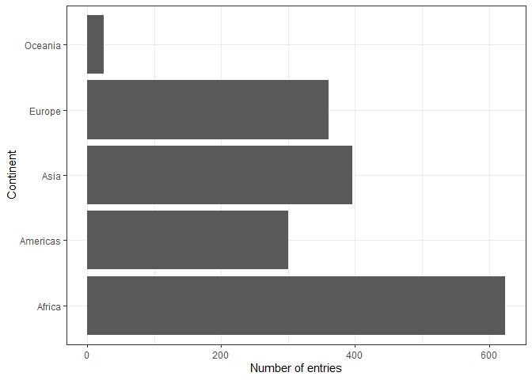

```
## -- Attaching packages ---------------------------------------- tidyverse 1.3.0 --
```

```
## v ggplot2 3.3.0     v purrr   0.3.3
## v tibble  2.1.3     v dplyr   0.8.3
## v tidyr   1.0.2     v stringr 1.4.0
## v readr   1.3.1     v forcats 0.5.0
```

```
## -- Conflicts ------------------------------------------- tidyverse_conflicts() --
## x dplyr::filter() masks stats::filter()
## x dplyr::lag()    masks stats::lag()
```

# 9.3.1 Activity 1: Using Factors for Plotting 

**1.1** Let's look again into `gapminder` dataset and create a new cloumn, 
`life_level`, that contains five categories ("very high", "high","moderate", 
"low", "very low") based on life expectancy in 1997. Assign categories accoring 
to the table below:

| Criteria | life_level| 
|-------------|-----------|
| less than 23 | very low |
| between 23 and 48 | low |
| between 48 and 59 | moderate |
| between 59 and 70 | high |
| more than 70 | very high |

Function `case_when()` is a tidier way to vectorise multiple `if_else()` statements. 
You can read more about this function [here](https://dplyr.tidyverse.org/reference/case_when.html).


```r
gapminder %>% 
  filter(year == 1997) %>% 
  mutate(life_level = case_when(lifeExp < 23 ~ 'very low',
                                lifeExp < 48 ~ 'low',
                                lifeExp < 59 ~ 'moderate',
                                lifeExp < 70 ~ 'high',
                                # else
                                TRUE ~ 'very high')) %>% 
  ggplot() + 
  geom_boxplot(aes(x = life_level, y = gdpPercap)) +
  labs(y = "GDP per capita, $", x = "Life expectancy level, years") +
  theme_bw() 
```


Do you notice anything odd/wrong about the graph?

We can make a few observations:

- It seems that none of the countries had a "very low" life-expectancy in 1997. 

- However, since it was an option in our analysis it should be included in our plot. Right?

- Notice also how levels on x-axis are placed in the "wrong" order.

**1.2** You can correct these issues by explicitly setting the levels parameter 
in the call to `factor()`. Use, `drop = FALSE` to tell the plot not to drop 
unused levels.


```r
gapminder %>% 
  filter(year == 1997) %>% 
  mutate(life_level = factor(case_when(lifeExp < 23 ~ 'very low',
                                       lifeExp < 48 ~ 'low',
                                       lifeExp < 59 ~ 'moderate',
                                       lifeExp < 70 ~ 'high',
                                       # else
                                       TRUE ~ 'very high'),
                             levels = c("very low", "low", "moderate", "high", "very high"))) %>%
  ggplot() + 
  geom_boxplot(aes(x = life_level, y = gdpPercap)) +
  labs(y = "GDP per capita, $", x = "Life expectancy level, years") +
  theme_bw() +
  scale_x_discrete(drop = FALSE)
```


# 9.4 Activity 2: Inspecting Factors

In Activity 1, we created our own factors, so now let's explore what 
categorical variables that we have in the `gapminder` dataset.

# 9.4.1 Exploring `gapminder$continent`

Use functions such as `str()`, `levels()`, `nlevels()` and `class()` to 
answer the following questions:

- What class (type of object) is `continent` (a factor or character)?
It is a factor.
- How many levels? What are they?
There are five levels: Africa, Americas, Asia, Europe, and Oceania
- What integer is used to represent factor "Asia"?
The integer 3 is used to represent this factor.


```r
data(gapminder)
class(gapminder$continent)
```

```
## [1] "factor"
```

```r
levels(gapminder$continent)
```

```
## [1] "Africa"   "Americas" "Asia"     "Europe"   "Oceania"
```

```r
nlevels(gapminder$continent)
```

```
## [1] 5
```

```r
str(gapminder$continent)
```

```
##  Factor w/ 5 levels "Africa","Americas",..: 3 3 3 3 3 3 3 3 3 3 ...
```

```r
# Gives continent integer associated with each country
gapminder %>% 
  pull(continent) %>% 
  as.numeric()
```

```
##    [1] 3 3 3 3 3 3 3 3 3 3 3 3 4 4 4 4 4 4 4 4 4 4 4 4 1 1 1 1 1 1 1 1 1 1 1 1 1
##   [38] 1 1 1 1 1 1 1 1 1 1 1 2 2 2 2 2 2 2 2 2 2 2 2 5 5 5 5 5 5 5 5 5 5 5 5 4 4
##   [75] 4 4 4 4 4 4 4 4 4 4 3 3 3 3 3 3 3 3 3 3 3 3 3 3 3 3 3 3 3 3 3 3 3 3 4 4 4
##  [112] 4 4 4 4 4 4 4 4 4 1 1 1 1 1 1 1 1 1 1 1 1 2 2 2 2 2 2 2 2 2 2 2 2 4 4 4 4
##  [149] 4 4 4 4 4 4 4 4 1 1 1 1 1 1 1 1 1 1 1 1 2 2 2 2 2 2 2 2 2 2 2 2 4 4 4 4 4
##  [186] 4 4 4 4 4 4 4 1 1 1 1 1 1 1 1 1 1 1 1 1 1 1 1 1 1 1 1 1 1 1 1 3 3 3 3 3 3
##  [223] 3 3 3 3 3 3 1 1 1 1 1 1 1 1 1 1 1 1 2 2 2 2 2 2 2 2 2 2 2 2 1 1 1 1 1 1 1
##  [260] 1 1 1 1 1 1 1 1 1 1 1 1 1 1 1 1 1 2 2 2 2 2 2 2 2 2 2 2 2 3 3 3 3 3 3 3 3
##  [297] 3 3 3 3 2 2 2 2 2 2 2 2 2 2 2 2 1 1 1 1 1 1 1 1 1 1 1 1 1 1 1 1 1 1 1 1 1
##  [334] 1 1 1 1 1 1 1 1 1 1 1 1 1 1 1 2 2 2 2 2 2 2 2 2 2 2 2 1 1 1 1 1 1 1 1 1 1
##  [371] 1 1 4 4 4 4 4 4 4 4 4 4 4 4 2 2 2 2 2 2 2 2 2 2 2 2 4 4 4 4 4 4 4 4 4 4 4
##  [408] 4 4 4 4 4 4 4 4 4 4 4 4 4 1 1 1 1 1 1 1 1 1 1 1 1 2 2 2 2 2 2 2 2 2 2 2 2
##  [445] 2 2 2 2 2 2 2 2 2 2 2 2 1 1 1 1 1 1 1 1 1 1 1 1 2 2 2 2 2 2 2 2 2 2 2 2 1
##  [482] 1 1 1 1 1 1 1 1 1 1 1 1 1 1 1 1 1 1 1 1 1 1 1 1 1 1 1 1 1 1 1 1 1 1 1 4 4
##  [519] 4 4 4 4 4 4 4 4 4 4 4 4 4 4 4 4 4 4 4 4 4 4 1 1 1 1 1 1 1 1 1 1 1 1 1 1 1
##  [556] 1 1 1 1 1 1 1 1 1 4 4 4 4 4 4 4 4 4 4 4 4 1 1 1 1 1 1 1 1 1 1 1 1 4 4 4 4
##  [593] 4 4 4 4 4 4 4 4 2 2 2 2 2 2 2 2 2 2 2 2 1 1 1 1 1 1 1 1 1 1 1 1 1 1 1 1 1
##  [630] 1 1 1 1 1 1 1 2 2 2 2 2 2 2 2 2 2 2 2 2 2 2 2 2 2 2 2 2 2 2 2 3 3 3 3 3 3
##  [667] 3 3 3 3 3 3 4 4 4 4 4 4 4 4 4 4 4 4 4 4 4 4 4 4 4 4 4 4 4 4 3 3 3 3 3 3 3
##  [704] 3 3 3 3 3 3 3 3 3 3 3 3 3 3 3 3 3 3 3 3 3 3 3 3 3 3 3 3 3 3 3 3 3 3 3 3 3
##  [741] 3 3 3 3 4 4 4 4 4 4 4 4 4 4 4 4 3 3 3 3 3 3 3 3 3 3 3 3 4 4 4 4 4 4 4 4 4
##  [778] 4 4 4 2 2 2 2 2 2 2 2 2 2 2 2 3 3 3 3 3 3 3 3 3 3 3 3 3 3 3 3 3 3 3 3 3 3
##  [815] 3 3 1 1 1 1 1 1 1 1 1 1 1 1 3 3 3 3 3 3 3 3 3 3 3 3 3 3 3 3 3 3 3 3 3 3 3
##  [852] 3 3 3 3 3 3 3 3 3 3 3 3 3 3 3 3 3 3 3 3 3 3 3 3 3 1 1 1 1 1 1 1 1 1 1 1 1
##  [889] 1 1 1 1 1 1 1 1 1 1 1 1 1 1 1 1 1 1 1 1 1 1 1 1 1 1 1 1 1 1 1 1 1 1 1 1 1
##  [926] 1 1 1 1 1 1 1 1 1 1 1 3 3 3 3 3 3 3 3 3 3 3 3 1 1 1 1 1 1 1 1 1 1 1 1 1 1
##  [963] 1 1 1 1 1 1 1 1 1 1 1 1 1 1 1 1 1 1 1 1 1 1 2 2 2 2 2 2 2 2 2 2 2 2 3 3 3
## [1000] 3 3 3 3 3 3 3 3 3 4 4 4 4 4 4 4 4 4 4 4 4 1 1 1 1 1 1 1 1 1 1 1 1 1 1 1 1
## [1037] 1 1 1 1 1 1 1 1 3 3 3 3 3 3 3 3 3 3 3 3 1 1 1 1 1 1 1 1 1 1 1 1 3 3 3 3 3
## [1074] 3 3 3 3 3 3 3 4 4 4 4 4 4 4 4 4 4 4 4 5 5 5 5 5 5 5 5 5 5 5 5 2 2 2 2 2 2
## [1111] 2 2 2 2 2 2 1 1 1 1 1 1 1 1 1 1 1 1 1 1 1 1 1 1 1 1 1 1 1 1 4 4 4 4 4 4 4
## [1148] 4 4 4 4 4 3 3 3 3 3 3 3 3 3 3 3 3 3 3 3 3 3 3 3 3 3 3 3 3 2 2 2 2 2 2 2 2
## [1185] 2 2 2 2 2 2 2 2 2 2 2 2 2 2 2 2 2 2 2 2 2 2 2 2 2 2 2 2 3 3 3 3 3 3 3 3 3
## [1222] 3 3 3 4 4 4 4 4 4 4 4 4 4 4 4 4 4 4 4 4 4 4 4 4 4 4 4 2 2 2 2 2 2 2 2 2 2
## [1259] 2 2 1 1 1 1 1 1 1 1 1 1 1 1 4 4 4 4 4 4 4 4 4 4 4 4 1 1 1 1 1 1 1 1 1 1 1
## [1296] 1 1 1 1 1 1 1 1 1 1 1 1 1 3 3 3 3 3 3 3 3 3 3 3 3 1 1 1 1 1 1 1 1 1 1 1 1
## [1333] 4 4 4 4 4 4 4 4 4 4 4 4 1 1 1 1 1 1 1 1 1 1 1 1 3 3 3 3 3 3 3 3 3 3 3 3 4
## [1370] 4 4 4 4 4 4 4 4 4 4 4 4 4 4 4 4 4 4 4 4 4 4 4 1 1 1 1 1 1 1 1 1 1 1 1 1 1
## [1407] 1 1 1 1 1 1 1 1 1 1 4 4 4 4 4 4 4 4 4 4 4 4 3 3 3 3 3 3 3 3 3 3 3 3 1 1 1
## [1444] 1 1 1 1 1 1 1 1 1 1 1 1 1 1 1 1 1 1 1 1 1 4 4 4 4 4 4 4 4 4 4 4 4 4 4 4 4
## [1481] 4 4 4 4 4 4 4 4 3 3 3 3 3 3 3 3 3 3 3 3 3 3 3 3 3 3 3 3 3 3 3 3 1 1 1 1 1
## [1518] 1 1 1 1 1 1 1 3 3 3 3 3 3 3 3 3 3 3 3 1 1 1 1 1 1 1 1 1 1 1 1 2 2 2 2 2 2
## [1555] 2 2 2 2 2 2 1 1 1 1 1 1 1 1 1 1 1 1 4 4 4 4 4 4 4 4 4 4 4 4 1 1 1 1 1 1 1
## [1592] 1 1 1 1 1 4 4 4 4 4 4 4 4 4 4 4 4 2 2 2 2 2 2 2 2 2 2 2 2 2 2 2 2 2 2 2 2
## [1629] 2 2 2 2 2 2 2 2 2 2 2 2 2 2 2 2 3 3 3 3 3 3 3 3 3 3 3 3 3 3 3 3 3 3 3 3 3
## [1666] 3 3 3 3 3 3 3 3 3 3 3 3 3 3 3 1 1 1 1 1 1 1 1 1 1 1 1 1 1 1 1 1 1 1 1 1 1
## [1703] 1 1
```

# 9.4.2 Exploring `gapminder$country`

Let's explore what else we can do with factors. Answer the following questions: 

- How many levels are there in `country`?
There are 142 levels
- Filter `gapminder` dataset by 5 countries of your choice. How many levels are 
  in your filtered dataset?
There are still 142 levels


```r
nlevels(gapminder$country)
```

```
## [1] 142
```

```r
five_country <- gapminder %>%
  filter(country %in% c("Venezuela", "Colombia", "Brazil", "Peru", "Bolivia"))

nlevels(five_country$country) #Still 142 levels - doesn't drop levels just because no values matching; use droplevels to drop levels
```

```
## [1] 142
```

# 9.5 Dropping Unused Levels

What if we want to get rid of some levels that are "unused" -- how do we do that? 

The function `droplevels()` operates on all the factors in a data frame or on a 
single factor. The function `forcats::fct_drop()` operates on a factor and does 
not drop `NA` values.


```r
five_country_drop <- five_country %>%
  droplevels()
nlevels(five_country_drop$country)
```

```
## [1] 5
```

# 9.6 Changing the Order of Levels

Let's say we wanted to re-order the levels of a factor using a new metric - say, count().

We should first produce a frequency table as a tibble using `dplyr::count()`:


```r
gapminder %>%
  count(continent)
```

```
## # A tibble: 5 x 2
##   continent     n
##   <fct>     <int>
## 1 Africa      624
## 2 Americas    300
## 3 Asia        396
## 4 Europe      360
## 5 Oceania      24
```

The table is nice, but it would be better to visualize the data.
Factors are most useful/helpful when plotting data.
So let's first plot this:


```r
gapminder %>%
  ggplot() +
  geom_bar(aes(continent)) +
  coord_flip() +
  theme_bw() +
  ylab("Number of entries") + xlab("Continent")
```



Think about how levels are normally ordered. 
It turns out that by default, R always sorts levels in alphabetical order. 
However, it is often preferable to order the levels according to some principle:

  1. Frequency/count (`fct_infreq()`)
  2. Order of appearance (`fct_inorder()`)
  3. Sequence of the underlying integers (`fct_inseq()`)
  
- Make the most common level the first and so on. Function like `fct_infreq()` 
  might be useful.
- The function `fct_rev()` will sort them in the opposite order.


```r
gapminder %>%
  ggplot() +
  geom_bar(aes(fct_infreq(continent))) +
  coord_flip() +
  theme_bw() +
  ylab("Number of entries") + xlab("Continent")
```


Section 9.6 of Jenny Bryan's [notes](https://stat545.com/factors-boss.html#reorder-factors) has some helpful examples.

  4. Another variable. 
  
  - For example, if we wanted to bring back our example of ordering `gapminder` 
    countries by life expectancy, we can visualize the results using `fct_reorder()`. 


```r
##  default summarizing function is median()
gapminder %>%
  ggplot() +
  geom_bar(aes(fct_reorder(continent, lifeExp, max))) +
  coord_flip() +
  theme_bw() +
  xlab("Continent") + ylab("Number of entries")
```


Use `fct_reorder2()` when you have a line chart of a quantitative x against 
another quantitative y and your factor provides the color. 


```r
## order by life expectancy 
ggplot(five_country, aes(x = year, y = lifeExp,
                  color = fct_reorder2(country, year, lifeExp))) +
  geom_line() +
  labs(color = "Country")
```


# 9.7 Changing Order of the Levels Manually

This might be useful if you are preparing a report for say, the state of affairs 
in Africa.


```r
gapminder %>%
  ggplot() +
  geom_bar(aes(fct_relevel(continent, "Oceania"))) +
  coord_flip()+
  theme_bw() 
```


More details on reordering factor levels by hand can be found 
[here](https://forcats.tidyverse.org/reference/fct_relevel.html).

# 9.8 Recoding Factors

Sometimes you want to specify what the levels of a factor should be.
For instance, if you had levels called "blk" and "brwn", you would rather they 
be called "Black" and "Brown" -- this is called recoding.

Lets recode `Oceania` and the `Americas` in the graph above as abbreviations 
`OCN` and `AME` respectively using the function `fct_recode()`.


```r
gapminder %>%
  ggplot() +
  geom_bar(aes(fct_recode(continent, "OCN" = "Oceania", "AME" = "Americas"))) +
  coord_flip() +
  theme_bw()
```


# 9.9 Growing a Factor (OPTIONAL)

Let’s create two data frames,`df1` and `df2` each with data from two countries, 
dropping unused factor levels.


```r
df1 <- gapminder %>%
  filter(country %in% c("United States", "Mexico"), year > 2000) %>%
  droplevels()
df2 <- gapminder %>%
  filter(country %in% c("France", "Germany"), year > 2000) %>%
  droplevels()
```

The country factors in `df1` and `df2` have different levels.
Can you just combine them using `c()`?


```r
c(df1$country, df2$country)
```

```
## [1] 1 1 2 2 1 1 2 2
```

Use `fct_c()` to perform `c()`, but also combine the levels of the two factor
variables:


```r
fct_c(df1$country, df2$country)
```

```
## [1] Mexico        Mexico        United States United States France       
## [6] France        Germany       Germany      
## Levels: Mexico United States France Germany
```

Explore how different forms of row binding work behave here, in terms of the 
country variable in the result. 


```r
bind_rows(df1, df2)
```

```
## # A tibble: 8 x 6
##   country       continent  year lifeExp       pop gdpPercap
##   <chr>         <chr>     <int>   <dbl>     <int>     <dbl>
## 1 Mexico        Americas   2002    74.9 102479927    10742.
## 2 Mexico        Americas   2007    76.2 108700891    11978.
## 3 United States Americas   2002    77.3 287675526    39097.
## 4 United States Americas   2007    78.2 301139947    42952.
## 5 France        Europe     2002    79.6  59925035    28926.
## 6 France        Europe     2007    80.7  61083916    30470.
## 7 Germany       Europe     2002    78.7  82350671    30036.
## 8 Germany       Europe     2007    79.4  82400996    32170.
```

```r
rbind(df1, df2)
```

```
## # A tibble: 8 x 6
##   country       continent  year lifeExp       pop gdpPercap
##   <fct>         <fct>     <int>   <dbl>     <int>     <dbl>
## 1 Mexico        Americas   2002    74.9 102479927    10742.
## 2 Mexico        Americas   2007    76.2 108700891    11978.
## 3 United States Americas   2002    77.3 287675526    39097.
## 4 United States Americas   2007    78.2 301139947    42952.
## 5 France        Europe     2002    79.6  59925035    28926.
## 6 France        Europe     2007    80.7  61083916    30470.
## 7 Germany       Europe     2002    78.7  82350671    30036.
## 8 Germany       Europe     2007    79.4  82400996    32170.
```
